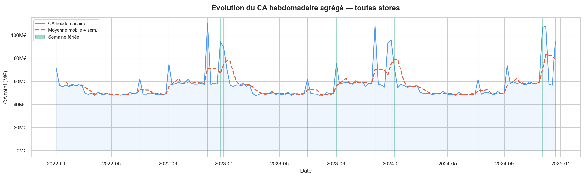
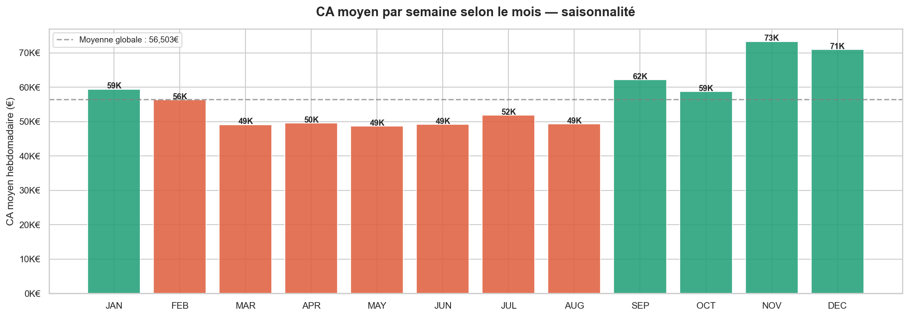

# Retail Store Sales — Analyse Marketing Data
## Optimisation des ventes hebdomadaires par magasin, département et période promotionnelle

> **Problématique** : Comment identifier les leviers d'optimisation des ventes hebdomadaires par magasin et département, en mesurant l'impact des promotions (markdowns), des périodes de fêtes et du type de magasin sur le chiffre d'affaires ?

---

## 🗂️ Structure du projet

```
Retail-Store-Sales/
│
├── 📁 data/
│   ├── 📁 raw/                 # Fichiers sources (train.csv, stores.csv, features.csv, test.csv)
│   ├── 📁 processed/           # Données nettoyées, jointes et enrichies
│   └── 📁 star_schema/         # Tables de dimensions et de faits prêtes pour l'analyse
│
├── 📁 docs/                    # Documentation complémentaire
│
├── 📓 notebooks/
│   ├── 📄 01_chargement_jointures.ipynb  # Qualité des données, jointures et nettoyage
│   ├── 📄 02_eda_analyse.ipynb           # Analyse exploratoire (EDA) & segmentation des magasins
│   ├── 📄 03_sql_analyse.ipynb           # Prototypage et requêtes SQL avancées
│   └── 📄 04_dashboard_prep.ipynb        # Préparation et agrégation des données pour Power BI
│
├── 📤 outputs/
│   ├── 📁 figures/             # Graphiques et visualisations exportés (.png, .jpeg)
│   ├── 📁 tables/              # Extractions et KPI intermédiaires (.csv)
│   └── 📁 powerbi/             # Rapport Power BI (.pbix) et exports
│
├── 🐍 scripts/
│   ├── 📄 data_loader.py       # Fonctions de chargement et pipeline de nettoyage
│   ├── 📄 sql_helpers.py       # Connexion PostgreSQL & exécution des requêtes
│   └── 📄 viz_helpers.py       # Fonctions de visualisation réutilisables
│
├── 🗄️ sql/
│   ├── 📄 01_exploration.sql         # Requêtes de découverte et statistiques descriptives
│   └── 📄 02_analyses_avancees.sql   # Calcul des KPI complexes et vues analytiques
│
├── ⚙️ .gitignore               # Exclusion des fichiers système et des identifiants
├── 📋 requirements.txt         # Dépendances Python (pandas, psycopg2, matplotlib...)
└── 📝 README.md                # Présentation du projet, installation et cas d'usage
```

---

## ❓ Questions auxquelles ce projet répond

1. Quels magasins et départements génèrent le plus de CA hebdomadaire ?
2. Les semaines de fêtes sur-performent-elles réellement ?
3. Les promotions (MarkDown1-5) ont-elles un impact mesurable sur les ventes ?
4. Le type de magasin (A/B/C) influence-t-il la performance ?
5. Peut-on segmenter les magasins par profil de performance ?

---

## Schéma en étoile Power BI

```
          DIM_DATE ──────────────────────┐
              │                          │
         DIM_STORE ──── FACT_SALES ──── DIM_MARKDOWN
              │              │
          DIM_DEPT ──────────┘
```


## 📊 Principaux insights

*Périmètre : 50 magasins · 20 départements · 156 semaines (janv. 2022 – déc. 2024) · 8,81 Md€ de CA*

| Question | Résultat | Impact business |
|---|---|---|
| Concentration du CA | Les 10 premiers magasins (20 % du parc) réalisent **33 %** du CA. Tous sont de type A et de grande taille | Prioriser ces magasins pour les tests d'optimisation |
| Type de magasin | Les magasins de type A (52 % du parc) génèrent **74 %** du CA, avec un CA moyen **~5 fois** supérieur au type C (80 067 € vs 16 223 €/semaine/département) | L'écart suit la taille des magasins : le levier est la surface, pas le type seul |
| Effet des fêtes | Les semaines fériées affichent un CA moyen supérieur de **+60 %** en moyenne, mais avec de fortes disparités : **Black Friday +104 %**, Noël +77 %, Labor Day +42 %, Nouvel An +34 %, Independence Day seulement +17 % | Concentrer stocks, effectifs et budget marketing sur Black Friday et Noël |
| Saisonnalité | Novembre est le meilleur mois (**+30 %** vs la moyenne), mai le plus faible. Le T4 surperforme chaque année | Préparer le pic de fin d'année dès octobre |
| Impact des promotions | Aucun effet mesurable de l'intensité promotionnelle à calendrier égal : en semaine fériée, promo forte (83 040 €) ≈ promo modérée (86 935 €) ; en semaine normale, promo faible (53 735 €) ≈ promo modérée (52 825 €). La hausse apparente des promos fortes s'explique par le calendrier, car elles ne sont appliquées que pendant les fêtes | Le budget de démarque ne semble pas générer de ventes additionnelles : à tester |
| Segmentation | Les magasins sont répartis en 3 terciles de performance (Top / Mid / Low). Le Top performer est dominé par les grands magasins de type A | Adapter les actions (assortiment, promos) par tercile |

## 💡 Recommandations

1. **Concentrer les investissements sur les 20 grands magasins de type A** : ils représentent 40 % du parc pour 60 % du CA.
2.  **Faire de Black Friday et Noël les deux temps forts de l'année** : ces deux semaines génèrent respectivement +104 % et +77 % de CA par rapport à une semaine normale. La préparation (stocks, renforts, campagnes) doit démarrer dès octobre. À l'inverse, l'Independence Day (+17 %) ne justifie pas de dispositif spécifique.
3. **Remettre en question le budget de démarque** : à calendrier égal, augmenter l'intensité des promotions n'est associé à aucune hausse du CA. Les fêtes génèrent le pic de ventes, pas les promos. Avant de réduire ce budget, lancer un test contrôlé (promo forte hors période fériée sur un groupe de magasins, comparé à un groupe témoin) pour mesurer l'effet réel.
4. **Auditer les magasins de type C** : 8 magasins pour moins de 5 % du CA. Une analyse de rentabilité (coûts non disponibles ici) dirait s'il faut revoir l'assortiment ou le format.

## 📈 Visualisations




## ⚠️ Limites

- **Pas de semaine sans promotion** : 100 % des semaines ont un MarkDown actif. On ne peut donc pas mesurer l'effet « promo vs pas de promo », seulement l'effet de l'intensité.
- **Promotions et calendrier confondus** : les promos fortes n'ont été appliquées que pendant les fêtes, ce qui empêche d'isoler leur effet propre. L'analyse compare donc les niveaux de promo à calendrier égal.
- **Dataset synthétique** (Kaggle) : les conclusions illustrent une méthode d'analyse, pas un cas réel.
- **Pas de données de coûts** : l'analyse porte sur le CA, pas sur la marge.
---

## 🛠️ Stack technique

| Domaine | Outils |
|--------|--------|
| Langage | Python 3.12.7 |
| Manipulation données | Pandas, NumPy |
| SQL | PostgrSQL |
| Visualisation | Matplotlib, Seaborn |
| Dashboard | Power BI |
| Environnement | VS Code + Jupyter |

---

## Lancer le projet

```bash
git clone https://github.com/light971/Retail-Store-Sales.git
cd Retail-Store-Sales
pip install -r requirements.txt
jupyter notebook notebooks/01_chargement_jointures.ipynb
```

**Source** : [Kaggle — Retail Store Sales Forecasting Dataset](https://www.kaggle.com/datasets/noopurbhatt/retail-store-sales-forecasting-dataset)

---

*Malcom Closse · Marketing Data Analyst · github.com/light971*
